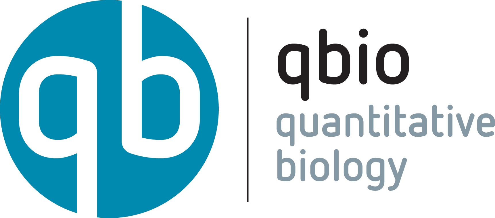

| QBIO MASTER PROGRAM| Quantitative biology in practice |
| ------------------------------------------------------------ | ---------------------------------------------- |
|  |  |

*At the  crossroads of Biology, Physics, Chemistry and Informatics, qbio is the  master program destined for students interested in studying Biology with a quantitative perspective founded on transdisciplinary approaches.*

# Introduction to qbio

[TOC] 

## Organisation

1st semester - 5 ECTS - 40 hours in the class. 

The majority of classes will not be "standard" lectures. Interaction will be privileged, and the attendants should prepare the class before the frontal lecture (see link column in the table below).

### Timetable

#### Instructors

[AA= Andrea Apolloni (CIRAD); EM = Emmanuel Margeat ; LC = Luca Ciandrini; LCo = Luca Costa ; MN = Marcelo Nolan; PEM = Pierre-Emmanuel Milhiet; SC = Sandra Cortijo (BPMP / SupAgro); JN = Jérémie Naud (IGF)]

#### Rooms
The course will take place in two different rooms at the CBS: The *seminar room* (1st floor, CBS29) and the *QuB* (to be pronounced 'cube', which is the Algeco just outside the main entrance of the CBS29).

Slots are usually 1.5h long.

| Date            | Day  |   #hours | Time | Topic                                                      | Where | Who | Link |
| :-------------- | ---- | -------: | ------------- | ------------------------------------------------------------ | ----- | ---- | ---- |
| 15 September    | Thu  |      3.0 | 13:15-16:30     | Introduction and course organisation  (30') - Modelling tools: ODE                  | CBS - QuB  | LC | - D.J. Wilkinson, *"Stochastic modelling for quantitative description of heterogeneous biological systems"*, Nature Reviews (2009) [doi:10.1038/nrg2509](https://www.nature.com/articles/nrg2509)  - [Introductory construct](./constructs/UE_Introduction/Introduction.ipynb)  - [Modelling ODE](./constructs/UE_Introduction/Modelling_ODE.ipynb) |
| 15 September    | Thu  |      1.5 | 16:45-18:15     | Presentation of methodology and Jupyter labs (30'). Basics of image processing (1h). | CBS - QuB | MN| [constructList](https://github.com/qbiomaster/qBioMaster-introduction/blob/main/constructs/UE_Introduction/ConstructList.md) |
| 22 September    | Thu  |      3.0 | 13:15-16:30     | Modelling tools: Stochasticity and simulations  | CBS - Seminar room  | LC | - [Revise Exponential distribution](https://sixsigmastudyguide.com/exponential-distribution/)  - [Exponential distribution video](https://www.youtube.com/watch?v=2kg1O0j1J9c)  - [Uri Alon, An introduction to systems biology, 2nd Ed.](https://www.google.fr/books/edition/An_Introduction_to_Systems_Biology/Lg3MDwAAQBAJ?hl=fr&gbpv=1&dq=An+Introduction+to+Systems+Biology&pg=PA36&printsec=frontcover) - Ch1 and Ch2   - [Modelling stoc](./constructs/UE_Introduction/Modelling_stoc.ipynb) |
| 22 September    | Thu  |      1.5 | 16:45-18:15     | Introduction to fluorescence microscopy (EM). | CBS - Seminar room   | EM-MN| [constructList](https://github.com/qbiomaster/qBioMaster-introduction/blob/main/constructs/UE_Introduction/ConstructList.md) |
| 29 September    | Thu  |      1.5 | 13:15-14:45     |  Introduction to neurophysics                  | CBS - QuB  | JN | Revise Ch1 from [Strogaz' book](https://www.google.fr/books/edition/Nonlinear_Dynamics_and_Chaos/1kpnDwAAQBAJ?hl=en&gbpv=1&printsec=frontcover)   - [Associated notebook](./constructs/UE_Introduction/qbio_Course_1_JN.ipynb)|
| 29 September    | Thu  |      1.5 | 15:00-16:30   | TIRF microscopy (30'). SMLM (1h). | CBS - QuB  | MN | [constructList](https://github.com/qbiomaster/qBioMaster-introduction/blob/main/constructs/UE_Introduction/ConstructList.md) |
| 30 September    | Fri  |      1.5 | 11:30-13:00     | Gene regulation; Negative and positive autoregulation.         | CBS - QuB  | LC | 2nd chapter from [Uri Alon, An introduction to systems biology, 2nd Ed.](https://www.google.fr/books/edition/An_Introduction_to_Systems_Biology/Lg3MDwAAQBAJ?hl=fr&gbpv=1&dq=An+Introduction+to+Systems+Biology&pg=PA36&printsec=frontcover)   - [Associated notebook](./constructs/UE_Introduction/Gene_regulation.ipynb) |
| 6 October       | Thu  |      1.5 | 13:15-14:45    | Geometric analysis of excitability | CBS - Seminar room  | JN| Ch2 from [Strogaz' book](https://www.google.fr/books/edition/Nonlinear_Dynamics_and_Chaos/1kpnDwAAQBAJ?hl=en&gbpv=1&printsec=frontcover) |
| 6 October       | Thu  |      1.5 | 15:00-16:30    | 3D-SIM and STED (30').  Introduction to genome biophysics. DNA supercoiling (1h). | CBS - Seminar room  | MN| [constructList](https://github.com/qbiomaster/qBioMaster-introduction/blob/main/constructs/UE_Introduction/ConstructList.md) |
| 7 October       | Fri  |      1.5 | 11:30-13:00     |  Experimental characterization of biological membranes | CBS - QuB   | PEM| |
| 13 October      | Thu  |      1.5 | 15:00-16:30    | DNA origami (45') by Gaetan Bellot. Optical Tweezers (45') by F. Pedaci. | CBS - QuB      | Ext | [constructList](https://github.com/qbiomaster/qBioMaster-introduction/blob/main/constructs/UE_Introduction/ConstructList.md) |
| 14 October       | Fri  |      1.5 | 9:45-11:15     | Gene expression noise in plants  | CBS - QuB   | SC| |
| 20 October       | Thu  |      3.0 | 13:15-16:30     | Nucleosomes and epigenetics (1.5h). Transcription factors (45').  Diffusion of DNA binding proteins using sptPALM (45') | CBS - seminar room   | MN| |
| 21 October       | Fri  |      1.5 | 9:45-11:15     |   Random Walks - 2D RW and macromolecules as Random Walks | CBS - QuB   | LC| Read R.Phillips et al., Physical Biology of the cell, 2nd Ed. Pages 311 - 322; 127-129; (Ch13 is not compulsory, but a useful ref for the diffusion equation)   - [Associated notebook](./constructs/UE_Introduction/diffusion.ipynb)|
| 21 October       | Fri  |      1.5 | 9:45-11:15     |   Measuring Gene Expression from Cytometer and Plate Reader experiments | CBS - QuB   | LC|**To be rescheduled** |
| 21 October       | Fri  |      1.5 | 11:30-13:00     | Physics of Membranes - A theoretical point of view  | CBS - QuB   | MA| Material given by email |
| 21 October       | Fri  |      1.5 | 11:30-13:00     |  Imaging and spectroscopy of biological membranes | CBS - QuB   | PEM| **To be rescheduled** |
| 27 October      | Thu  |      1.5 | 15:00-16:30     | Confocal microscopy (30' - MN). Fluctuation microscopies (1h) (EM). | CBS  - seminar room   | MN-EM| [constructList](https://github.com/qbiomaster/qBioMaster-introduction/blob/main/constructs/UE_Introduction/ConstructList.md) |
| 28 October      | Fri  |      1.5 | 09:45-11:15    | Higher-order chromatin structure  (1h). Loop extrusion (30'). | CBS  -QuB  | MN| [constructList](https://github.com/qbiomaster/qBioMaster-introduction/blob/main/constructs/UE_Introduction/ConstructList.md) |
| 28 October       | Fri  |      1.5 | 11:30-13:00     | Probing membrane mechanics  | CBS - QuB   | LCo| |
| 15 November   | Tue  |      3.0 | 8:30-11:30     | Introduction to network theory                    | CBS - QuB  | AA |  |
| 17 November      | Thu  |      1.5 | 15:00-16:30    | External Talk by Thomas Robert (45'). Multiplexing methods I (45'). | CBS - seminar room  | MN| [constructList](https://github.com/qbiomaster/qBioMaster-introduction/blob/main/constructs/UE_Introduction/ConstructList.md) |
| 18 November     | Fri  |      1.5 | 10:45-12:15   | Multiplexing methods II (1h30).                              | CBS - QuB | MN| [constructList](https://github.com/qbiomaster/qBioMaster-introduction/blob/main/constructs/UE_Introduction/ConstructList.md) |

### Evaluation

Evaluation by projects (compulsory 5*20%). Students will have to return 5 compulsory homework projects - assignments, no other exam is planned.

#### Assignments 

Assignments given by LC should be sent to him by email (.ipynb file plus other needed material in case) by the deadline. Returning the homework with a delay will bring you a penalty.

When you send the assignment by email, please use the subject `Assignment X - Intro qbio` (where `X`is the number of the assignment); name the file as `AX_NameSurname.ipynb` and put all the necessary files (datasets, images,...) in a directory named `data`. Then zip the files and send the archive. For instance, when Luca sends the assignment 3, he will name the file `A3_LucaCiandrini.ipynb`, put all data in the folder `data`, compress everything in a single file to be sent in a message with subject `Assignment 3 - Intro qbio`.

## Bibliography (books only)

1. *An introduction to Systems Biology*, Uri Alon
2. *Physical Biology of the cell*, R. Phillips et al.
3. *Cell biology by the numbers*, R. Milo and R. Phillips
4. *Biological Physics: Energy, Information, Life*, Philip Nelson
5. *Random Walks in Biology*, Howard
6. *A first course in Network Science*, F. Menczer, S. Fortunato and C. A. Davis
7. *Network Science*,A.L Barabasi, available on line http://networksciencebook.com/

